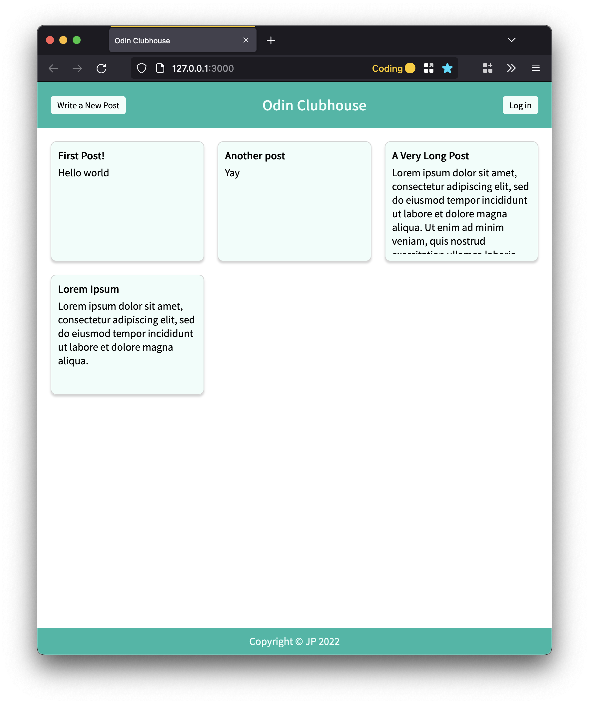
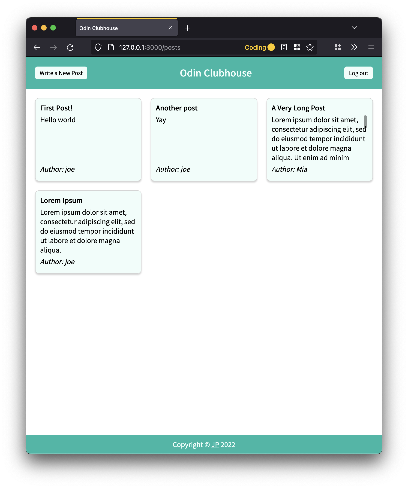
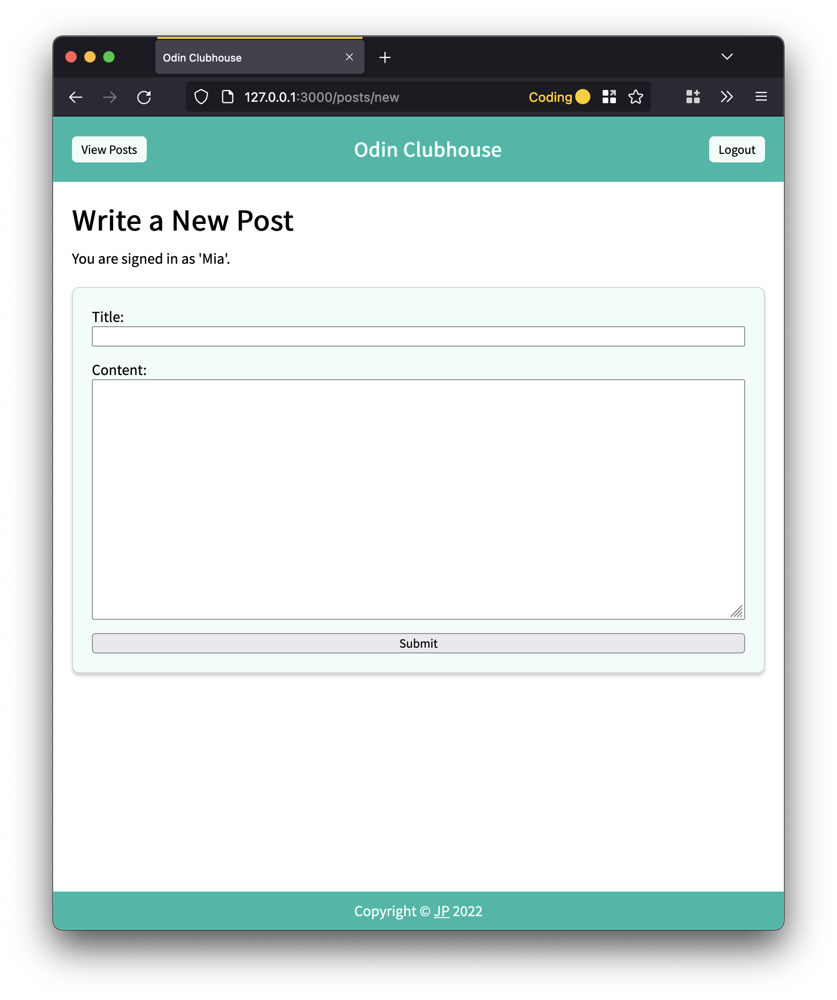
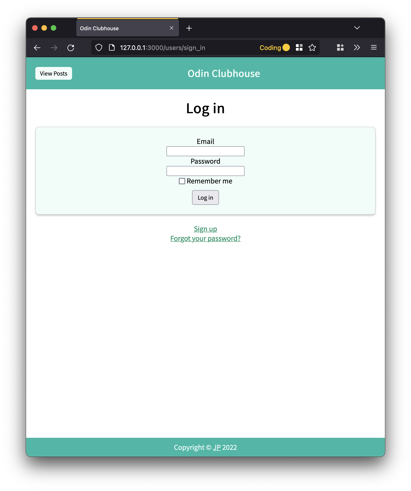

# Odin Members Only!

Built as part of [The Odin Project's Full Stack Ruby on Rails](https://www.theodinproject.com/paths/full-stack-ruby-on-rails?) curriculum: [Project: Members Only!](https://www.theodinproject.com/lessons/ruby-on-rails-members-only) lesson.

In this app users can write posts that will be visible to all. However, only logged in users can view who wrote a post.

Posts Page (Public View) | Posts Page (Signed in View)
:-------------------------:|:-------------------------:
 | 

New Post Page | User Log in Page
:-------------------------:|:-------------------------:
 | 

## Techniques Implemented
* Working with User and Post model in a `belongs_to`/`has_many` relationship
* Devise gem for user authentication
* Tweaks to Devise to [work with Rails 7 and Turbo Drive](https://github.com/heartcombo/devise/wiki/Troubleshooting-Rails-7-and-Turbo-Drive)
* Styling of multiple pages using a shared CSS templates
* Styling inspired by [Tailwinds color theme 'Teal'](https://tailwindcss.com/docs/customizing-colors)
* Responsive design using CSS Grid
